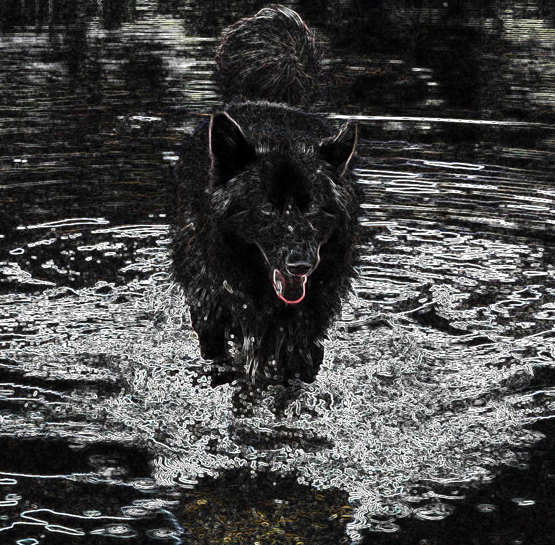
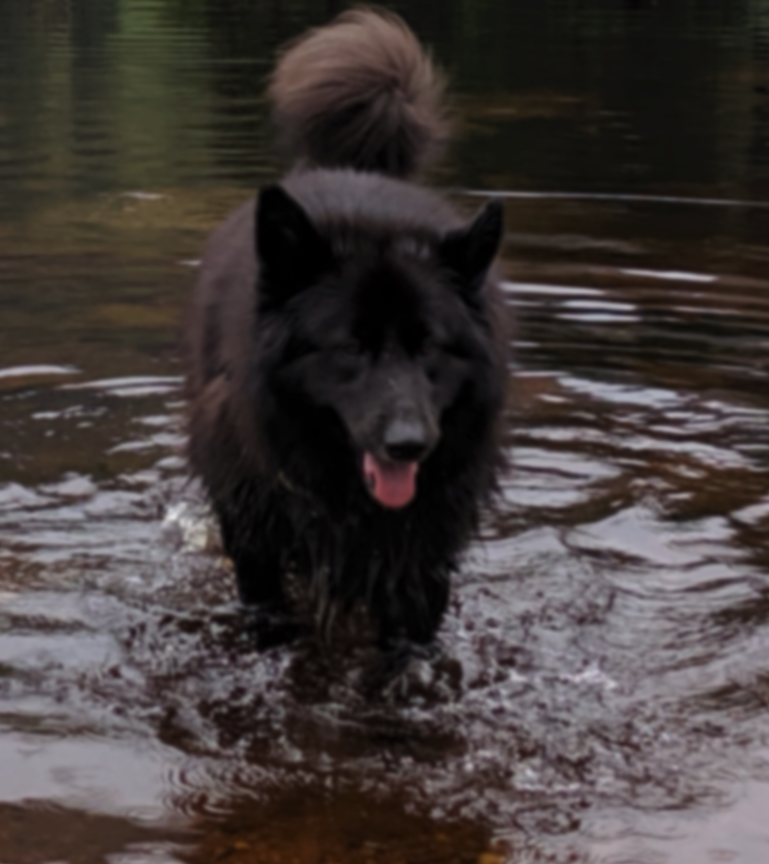
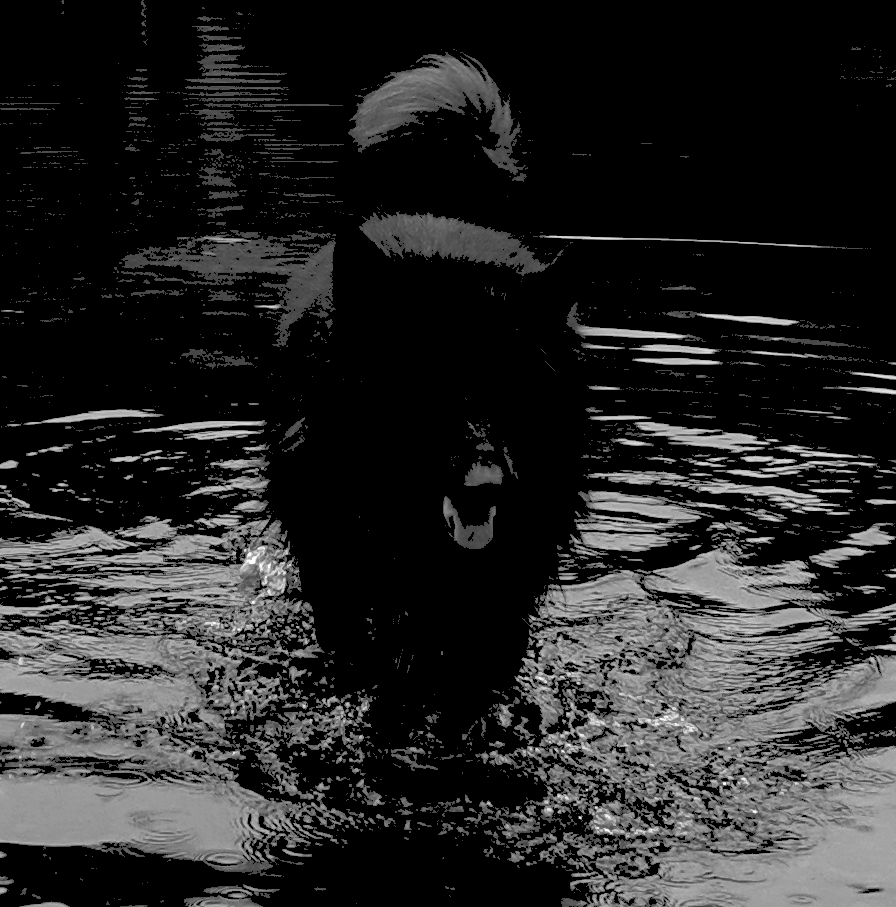

# Metal Performance Shaders
Metal Performance Shaders are a collection of builtin performant graphics and compute shaders by Apple to be used in your applications.

These shaders solve common problems and can speed up development by not requiring to write all you shaders from scratch

The documentation for this shader framework can be found at [Metal Performance Shaders](https://developer.apple.com/documentation/metalperformanceshaders)  

In the following examples I only used [MPS Image Filters](https://developer.apple.com/documentation/metalperformanceshaders/image_filters)

## Examples
### Below is my source image

### This is the image with a .22,.72,0.72 Sobel filter applied

### This is the image with a gaussian blur with a sigma of 2 applied

### This is the image with a linear gray color transform with a threshold of 0.3 applied

